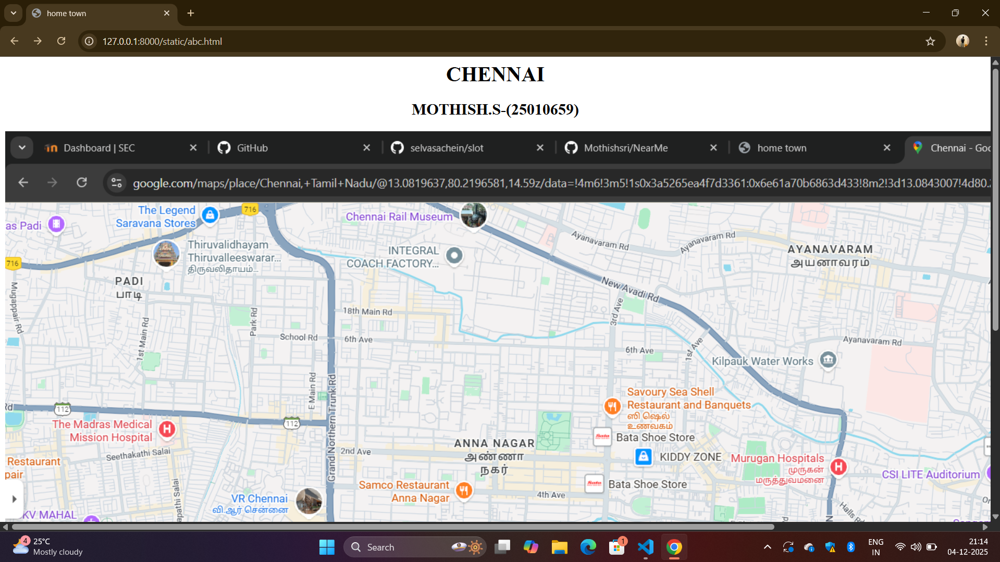

# Ex03 Places Around Me
## Date:4-12-2025
   
## AIM
To develop a website to display details about the places around my house.

## DESIGN STEPS

### STEP 1
Create a Django admin interface.

### STEP 2
Download your city map from Google as an image.

### STEP 3
Insert the image using `````` tag and link it to the map.

### STEP 4
Using ```<map>``` tag name the map.

### STEP 5
Create clickable regions in the image using ```<area>``` tag.

### STEP 6
Write HTML programs for all the regions identified.

### STEP 7
Execute the programs and publish them.

## CODE
'''
<html>
    <head>
        <title> home town</title>
    </head>
    <body>
        <h1 align="center"> CHENNAI</h1>
        <h2 align="center">MOTHISH.S-(25010659)</h2>
        

<map name="image-map">
    <area target="" alt="MGM healthcare" title="MGM healthcare" href="mgm.html" coords="986,765,1157,828" shape="rect">
    <area target="" alt="sangam cinemas" title="sangam cinemas" href="sangam.html" coords="1554,618,51" shape="circle">
    <area target="" alt="VR MALL" title="VR MALL" href="vr.html" coords="380,532,317,572,324,613,442,601,432,552" shape="poly">
    <area target="" alt="murugan hospitals" title="murugan hospitals" href="murugan.html" coords="1230,516,71" shape="circle">
    <area target="" alt="koyambedu" title="koyambedu" href="koyam.html" coords="412,799,351,833,351,880,466,887,456,814" shape="poly">
</map>
    </body>
</html>

mgm.html

<html>
    <head>
        <title> CHENNAI</title>
    </head>
    <body bgcolor="pink">
        <h1 align="center">CHENNAI</h1>
        <h2 align="center">MGM HEALTHCARE</h2>
        <hr>
        <p>MGM Healthcare is a multi-specialty hospital in Chennai, India, known for its advanced quaternary care, particularly in organ transplants, cardiac sciences, and neurosciences.</p>

    </body>
</html>

sangam.html

<html>
    <head>
        <title> CHENNAI</title>
    </head>
    <body bgcolor="lightgreen">
        <h1 align="center">CHENNAI</h1>
        <h2 align="center">SANGAM CINEMAS</h2>
        <hr>
        <p>Sangam Cinemas is a multiplex cinema located in Kilpauk, Chennai, offering a modern movie-watching experience with multiple screens, advanced technology like 4K Laser and Dolby Atmos, and various seating options, including Executive class leather sofas</p>
    </body>
</html>

vr.html

<html>
    <head>
        <title> CHENNAI</title>
    </head>
    <body bgcolor="yellow">
        <h1 align="center">CHENNAI</h1>
        <h2 align="center">VR MALL </h2>
        <hr>
        <p>VR Mall, or VR Chennai, is a large shopping mall located in Anna Nagar, Chennai, opened in 2018. It features a wide variety of retail stores, a 10-screen PVR cinema, and numerous dining options. Beyond shopping and entertainment, it also offers other amenities such as a co-working space, a boutique hotel, and family-friendly activities like virtual reality games and a kids' play area. </p>
    </body>
</html>

murugan.html

<html>
    <head>
        <title>CHENNAI</title>
    </head>
    <body bgcolor="green">
        <h1 align="center">CHENNAI</h1>
        <h2 align="center">MURUGAN HOSPITALS</h2>
        <hr>
        <p>Murugan Hospitals is a multispecialty hospital in Kilpauk, Chennai, that provides a wide range of medical and surgical services, including 24-hour emergency and trauma care. Established in 2015, it is known for its specialized departments like cardiology, neurology, urology, oncology, and orthopedics. The hospital has over 250 doctors, is equipped with advanced technology, and offers services like robotic surgery, dialysis, and joint replacement surgeries. </p>
    </body>
</html>

koyam.html

<html>
    <head>
        <title>CHENNAI</title>
    </head>
    <body bgcolor="red">
        <h1 align="center">CHENNAI</h1>
        <h2 align="center">KOYAMBEDU</h2>
        <hr>
        <p>Koyambedu is a major hub in Chennai, Tamil Nadu, known for its large wholesale market complex and as a transportation center, especially for the Chennai Mofussil Bus Terminus (CMBT). The area is a bustling locality with a large market for fruits, vegetables, and flowers, and it's well-connected by road and the city's metro system. </p>
    </body>
</html>


'''
## OUTPUT
 


## RESULT
The program for implementing image maps using HTML is executed successfully.
